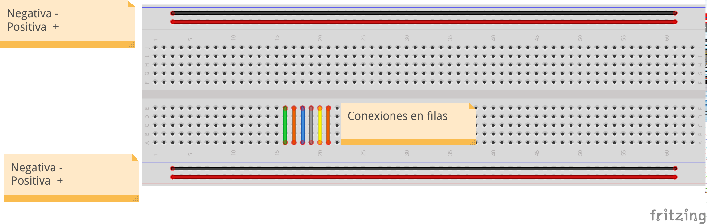
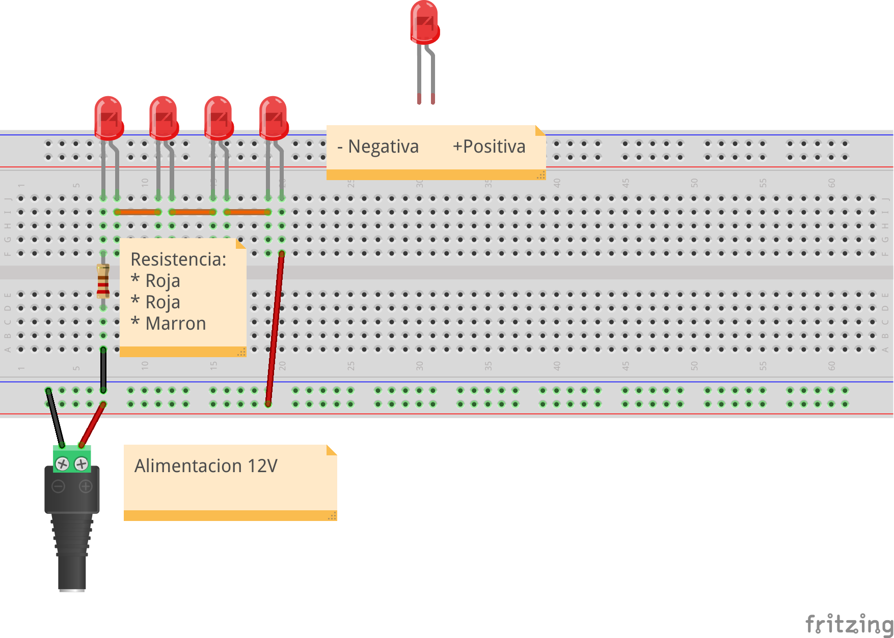
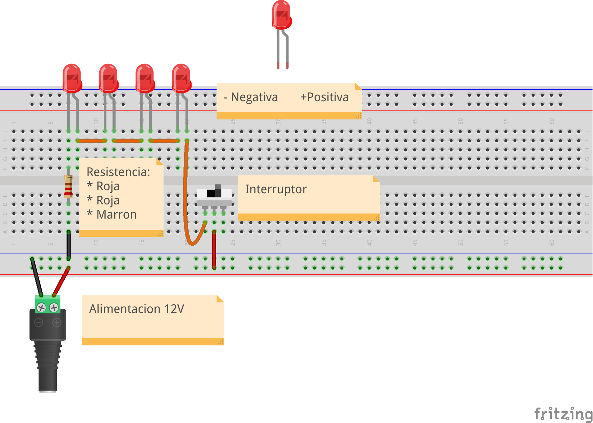
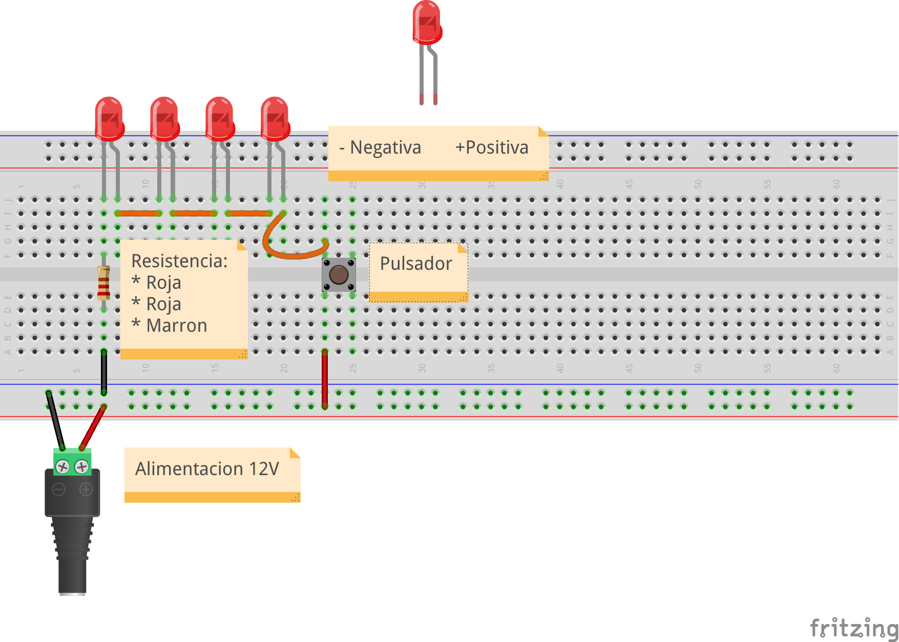
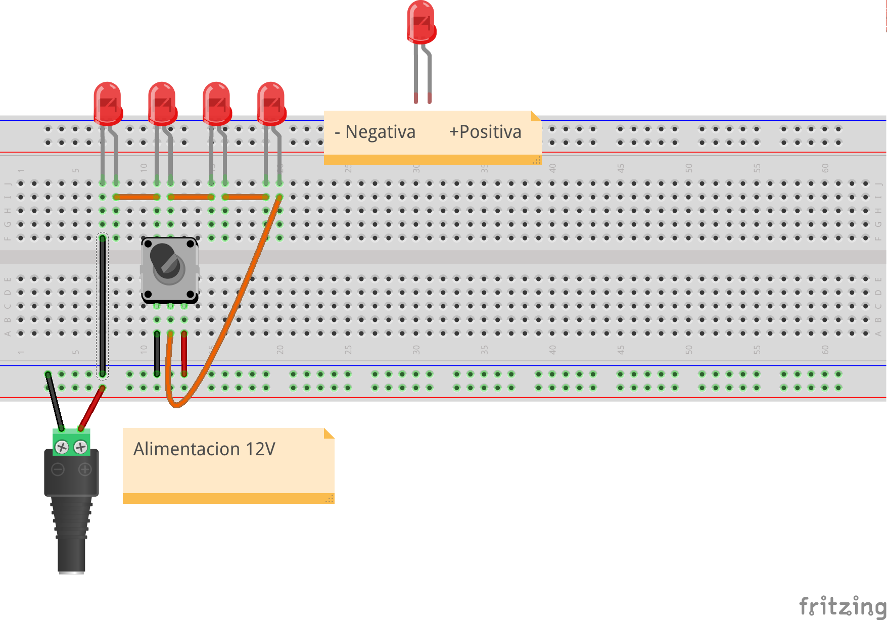

# Electricidad

## José Antonio Vacas @javacasm

## Montajes

### Placa de prototipo, conexiones

### Leds
* Leds
* polaridad
* Resistencias
* Medida con polímetro: voltaje e intensidad

### Pulsadores e interruptores

#### Interruptor

#### Pulsador

### Potenciometro

